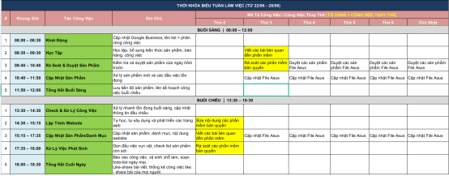

Thiết kế trang Timetable (Số cột và định dạng như hình - k cần màu) như sau:
1.Khi vào tab này lần đầu tiên phải hướng dẫn người dùng tạo bảng cho hiệu quả, đầu tiên phải thu thập thông tin người dùng từ các câu hỏi như sau:
- Câu hỏi 1: Thời gian bạn có thể làm việc tập trung tối đa cho MỘT công việc là bao lâu (Tối đa 2 tiếng)? 
- Câu hỏi 2: Công việc hàng ngày của bạn là công việc cố định hay công việc có tính linh hoạt cao?
- Câu hỏi 3: Thời điểm nào trong ngày mà bạn nghĩ mình nhiều năng lượng nhất (Sáng/Chiều)?
- Câu hỏi 4: Thời điểm nào trong ngày mà bạn nghĩ mình có thể tiếp thu kiến thức tốt nhất? (Sáng sớm/Trưa/Đầu giờ chiều/Tối) 
- Câu hỏi 5: Bạn có thể học tập lâu nhất là bao nhiêu lâu?
- Câu hỏi 6: Bạn có muốn tôi tích hợp các công việc của bạn từ Task Manager vào thời khoá biểu không?
2.Sau khi người dùng trả lời xong các câu trả lời, AI sẽ tạo bảng và tuỳ chỉnh bảng mẫu theo người dùng. Đây là cách phân tích từng câu hỏi theo quy tắc sau:
[📅 Phương pháp Hộp thời gian (Time Boxing)
Thay vì chỉ ghi "làm bài tập" hay "viết code", bạn hãy ấn định một khoảng thời gian cố định (ví dụ: 14:00 - 15:30) cho một công việc cụ thể. Khi hết thời gian, bạn bắt buộc phải dừng lại và chuyển sang việc tiếp theo.
Ưu điểm: Tránh trì hoãn, tạo áp lực thời gian tích cực để tập trung tối đa.
🧱 Phương pháp Khối thời gian (Time Blocking)
Chia một ngày thành các "khối" chức năng lớn. Ví dụ:
Khối Sáng (Deep Work): Dành cho các công việc đòi hỏi tư duy cao, logic khó (lập trình, học kiến thức mới).
Khối Chiều (Shallow Work): Dành cho công việc hành chính, họp hành, trả lời email, chỉnh sửa thiết kế nhẹ nhàng.
Khối Tối: Dành cho cá nhân, gia đình và giải trí.
🍅 Quy tắc Cà chua (Pomodoro)
Chia nhỏ thời gian làm việc thành các chu kỳ: 25 phút tập trung cao độ + 5 phút nghỉ ngắn. Sau 4 chu kỳ thì nghỉ dài 15 - 30 phút.
Ưu điểm: Rất hiệu quả khi bạn đang đối mặt với những phần việc nhàm chán hoặc dễ gây nản lòng.]
 Dựa trên câu hỏi, ta có:
- Câu hỏi 1: Thời gian tối ưu cho công việc cố định, dựa trên câu trả lời, nếu thời gian đó lớn hơn hoặc = 45phút x 2 thì chia ra 2 phase, mỗi phase dài bằng nhau và có thời gian nghỉ từ 5-10p (nghỉ 5 phút đối với 1 tiếng rưỡi, 10p đối với 2 tiếng, và k có thời gian nghỉ nếu dưới 1 tiếng 30 phút) 
- Câu hỏi 2: Nếu cố định thì build cấu trúc bảng như bảng mẫu. Nếu không cố định thì chỉ cần thêm các công việc cố định hàng ngày như: Khởi động đầu giờ sáng như bảng mẫu và Tổng kết cuối ngày.
- Câu hỏi 3: Nếu là sáng thì thêm 1 ô công việc quan trọng dựa vào câu trả lời của người dùng. Sau đó kết hợp thời gian của câu hỏi 1 để sắp xếp cho hợp lý
- Câu hỏi 4&5: Sắp xếp 1 ô dựa trên câu trả lời của người dùng để sắp xếp công việc cho hợp lý. Nếu sáng sớm thì sau giờ khởi đọng, trưa thì trước tổng kết buổi sáng, chiều thì bắt đầu từ 1 rưỡi, tối thì trước giờ tổng kết cuối ngày.
- Câu hỏi 6: Nếu có thì sắp xếp ở dãy cột mô tả công việc thuộc hàng công việc cố định quan trọng từ câu trả lời 1  và 3, nếu task đó có thời hạn => từ ngày tạo task tới ngày deadline, nếu deadline k thuộc ngày trong tuần thì task đó kéo dài nguyên tuần như google calendar, nếu có deadline thì ngày hôm đó phải tô đỏ.   
3.Logic:
- Có thể thay đổi thời gian cần để thực hiện từ bảng mà AI gợi ý
- Các cột là không thể thay đổi
- Các hàng cố định như: Khởi động, Tổng Kết Buổi Sáng, Tổng kết cuối ngày là không thể thay đổi vị trí, có thể thêm nhiều công việc nhưng khởi động luôn luôn ở đầu buổi sáng và 2 cái tổng kết luôn phải ở cuối 2 buổi => Người dùng k thể kéo thả 3 hàng này. 
- Người dùng có thể thay đổi vị trí các hàng không phải cột cố định và điều chỉnh thời gian đầu cuối để thực hiện công việc ( hàng nào cx có thể điều chỉnh thời gian cần thiết). Thay đổi vị trí bằng cách kéo thả các hàng
- Có thể thêm các hàng mới nếu cần thiết bằng cách để chuột vào ranh giới giữa các hàng và thêm nút (+) giữa các ranh giới, phải thêm cả icon thùng rác ở cuối hàng. Tuy nhiên nếu task này thời gian thực hiện = 0 phút thì k cho submit bảng.
- Ở dãy Mô tả công việc/Công việc thay thế, mỗi ô thuộc hàng nào đó có thể thêm nhiều hơn 1 công việc trong 1 ô.
- Từ câu hỏi 1,3: mỗi buổi phải có 1 thời gian làm việc dài (người dùng có khả năng tập trung vào buổi nào thì buổi đó có nguyên vẹn thời gian mà người dùng trả lời ở câu 1 và giảm 1/4 thời gian vào thời gian làm việc dài ở buổi còn lại)
- Các ô ghi chú người dùng có thể tuỳ ý chỉnh sửa

Yêu cầu trang:
Phải có nút cài đặt gồm 
- dãy list có tickbox để người dùng cho phép cột nào được hiển thị trên giao diện, và tickbox để cho phép AI lấy data từ taskmanager
- Có chức năng xuất bảng exel

ÀI LIỆU ĐẶC TẢ KIẾN TRÚC & BỘ 14 PROMPTS TRIỂN KHAI PHÂN HỆ THỜI KHÓA BIỂU THÔNG MINH

Tài liệu này hướng dẫn cách cấu hình, lập trình Phân hệ Thời khóa biểu tự động hóa (SPS Timetable) dựa trên phân tích hình ảnh image_28271c.jpg, kết hợp khảo sát Onboarding (6 câu hỏi), ma trận Time-boxing, cơ chế khóa hàng neo, kéo thả mượt mà, và xuất Excel ma trận.

📐 1. PHÂN TÍCH QUY TRÌNH & THUẬT TOÁN ĐỘNG (ALGORITHM SPECIFICATION)

Hệ thống sẽ chuyển đổi 6 câu trả lời khảo sát của người dùng thành một bảng thời gian biểu hoàn hảo dựa trên các lý thuyết năng suất khoa học:

A. Quy tắc chia Phase & Break ( Pomodoro - Q1 & Q3 ):

Gọi $T_{focus}$ là thời gian tập trung tối đa của người dùng nhập ở Câu 1 (giới hạn $T_{focus} \le 120$ phút).

Nếu $T_{focus} \ge 90$ phút: Chia làm 2 Phase bằng nhau.

Với $T_{focus} = 90$ phút: Mỗi Phase dài $45$ phút, có một khoảng nghỉ giữa giờ $T_{break} = 5$ phút.

Với $90 < T_{focus} \le 120$ phút: Mỗi Phase dài $\frac{T_{focus}}{2}$ phút, khoảng nghỉ $T_{break} = 10$ phút.

Nếu $T_{focus} < 90$ phút: Không chia Phase nghỉ giữa giờ ($T_{break} = 0$).

B. Phân bổ năng lượng theo buổi ( Q3 ):

Mỗi buổi (Sáng/Chiều) phải có 1 khoảng thời gian làm việc dài (Deep Work Block).

Buổi năng lượng đỉnh cao (được chọn ở Q3): Giữ nguyên vẹn thời gian tập trung tối đa $T_{focus}$ ở Câu 1.

Buổi năng lượng thấp: Thời gian tập trung tối đa cho khối công việc dài sẽ bị giảm đi $\frac{1}{4}$ thời gian ($0.75 \times T_{focus}$).

C. Logic Đăng ký & Tích hợp Task Manager ( Q6 ):

Nếu cho phép tích hợp, hệ thống sẽ tự động quét các Task đang mở của User để gán vào các ô "Mô tả công việc/Công việc thay thế":

Task có Deadline: Gắn vào ô của ngày Deadline, tô đỏ đậm ngày hôm đó trên bảng.

Task không có Deadline hoặc Deadline ngoài tuần: Kéo dài nguyên tuần (từ Thứ 2 đến Chủ nhật) giống cơ chế Google Calendar.

🗄️ 2. MÔ HÌNH DATABASE SCHEMA (PRISMA SCHEMA)

Bổ sung các model này vào prisma/schema.prisma để lưu trữ dữ liệu thời khóa biểu:

model UserTimetableConfig {
  id                  String   @id @default(uuid())
  user_id             String   @unique
  is_onboarded        Boolean  @default(false)
  
  // Lưu câu trả lời onboarding dạng JSON
  answers             Json?    // { q1: number, q2: string, q3: string, q4: string, q5: number, q6: boolean }
  
  show_columns        Json?    // Các cột cho phép hiển thị, mặc định ["no", "time", "task", "note", "mon", "tue", "wed", "thu", "fri", "sat", "sun"]
  sync_task_manager   Boolean  @default(true)
  
  user                User     @relation(fields: [user_id], references: [id], onDelete: Cascade)
  rows                TimetableRow[]
}

model TimetableRow {
  id             String         @id @default(uuid())
  config_id      String
  sort_order     Int            // Thứ tự hiển thị để kéo thả
  
  time_start     String         // Định dạng "HH:MM"
  time_end       String         // Định dạng "HH:MM"
  duration       Int            // Thời gian cần thiết (phút)
  
  task_name      String         // Tên công việc (Khởi động, Học tập...)
  is_locked      Boolean        @default(false) // Khóa cứng vị trí (Khởi động, 2 cái Tổng kết)
  session        String         // "MORNING" | "AFTERNOON"
  
  note           String?        @db.Text
  cells          TimetableCell[]

  config         UserTimetableConfig @relation(fields: [config_id], references: [id], onDelete: Cascade)
}

model TimetableCell {
  id             String       @id @default(uuid())
  row_id         String
  day_of_week    Int          // 1 (Thứ 2) -> 7 (Chủ Nhật)
  
  // Cho phép lưu nhiều công việc trong một ô
  tasks          Json?        // Danh sách dạng string[]: ["Cập nhật File Asus", "Học tiếng Anh"]
  is_deadline    Boolean      @default(false) // Đánh dấu tô đỏ ngày deadline
  
  row            TimetableRow @relation(fields: [row_id], references: [id], onDelete: Cascade)
  
  @@unique([row_id, day_of_week])
}

